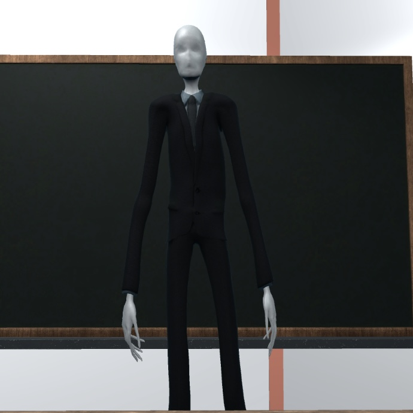

# Project 2 Report

## Role and Responsibility
* My Role: Project Manager & Environment/UX Designer
* Responsibilities
1. Project Management:
- Oversaw the full development cycle, including project planning, task delegation, team meetings, and documentation writing.
2.  Environment Design:
- Designed and assembled all game scenes in Unity, integrating and modifying assets from the Unity Asset Store to fit the project's style and requirements.
3. UX/UI Design:
- Created and implemented all in-game dialogue text to enhance narrative engagement.
- Designed and built the main game menu UI for an intuitive user experience.
- Gameplay Flow Improvement:
- Developed seamless scene transitions to ensure a smooth and immersive gameplay experience.

## Gameplay Link
THr game can be played on browser visa this link: https://yiiingjl.itch.io/me
  

    

    

<h1 align="center"><ins>G</ins>ame <ins>O</ins>verview</h1>

<h3><ins>C</ins>ore <ins>C</ins>oncept:</h3>

&nbsp;&nbsp;&nbsp;&nbsp;&nbsp;&nbsp;Our game "Me" aims to convey the struggles that mental illness can bring to young people's lives as well as highlight some potential triggers for this illness. This encourages player for greater understanding and awareness of mental health issues. Through this game, we lead player to understand mental illness is not something to be ashamed of -- with proper professional treatment and a clear understanding of the condition, symptoms can be alleviated or even fully cured.

&nbsp;&nbsp;&nbsp;&nbsp;&nbsp;&nbsp;"Me" is played from a first-person perspective, where players step into the shoes of a high school student suffering from schizophrenia. Through her eyes, players experience the symptoms of the illness. After gradually uncover evidence, players can piece together the protagonist's past and finally find out the triggers of her condition. At the beginning of the game, the character appears to be just an ordinary high school student, but as the game progresses, the world seen through the player's eyes, shaped by symptoms of schizophrenia, becomes increasingly surreal and bizarre. To successfully complete the game and assemble the full set of clues, players must navigate through these challenges. Once the truth is revealed, the game’s mechanics will make everything clear, helping players to better understand mental illness and to recognize the importance of accepting and supporting those who affected by it.

<h3><ins>R</ins>elated <ins>G</ins>enre(s):</h3>

&nbsp;&nbsp;&nbsp;&nbsp;&nbsp;&nbsp;Our game blends the mechanics of puzzle-solving and escape games to create a tense yet surreal atmosphere. For the puzzle-solving aspect, our team get inspired from the common symptoms of schizophrenia and the “Rusty Lake” series. We designed a series of simple but exploratory mini-games that players must solve while searching for clues.

&nbsp;&nbsp;&nbsp;&nbsp;&nbsp;&nbsp;Additionally, we integrated an escape game element into one if the mini-game. Adding element of time limitation heightens the sense of urgency and tension. This segment was partly inspired by the game “Outlast”. Unlike other puzzle or escape games, our game uniquely combines these two modes, allowing players to experience the thrill and pressure of an escape game while also engaging with the deeper meaning behind the puzzles.

&nbsp;&nbsp;&nbsp;&nbsp;&nbsp;&nbsp;Although the time-limited escape challenges add intensity, the game mechanics is relatively straightforward. However, our game is not solely about escape. The narrative woven throughout provides players with moments to catch their breath. It helps balance the tension with moments of reflection.

<h3><ins>T</ins>arget <ins>A</ins>udience:</h3>

&nbsp;&nbsp;&nbsp;&nbsp;&nbsp;&nbsp;Our game is designed for players of all ages, with a particular focus on students. More specifically, the story is based on the experiences of students who have gone through the Asian education system. We especially encourage students, including those who may be dealing with mental health issues, to test our game and provide feedback. This will allow our team to make improvements and better tailor the game to our audience's needs.

<h3><ins>U</ins>nique <ins>S</ins>elling <ins>P</ins>oints:</h3>

&nbsp;&nbsp;&nbsp;&nbsp;&nbsp;&nbsp;Our game stands out in several key ways. First, we offers an immersive psychological experience through a gradually unfolding storyline aims to deeply engage with players. Second, it combines a variety of mini-games with escape elements, allowing players to enjoy both the intellectual challenge of puzzles and the thrill of escaping. Third, the whole story is based on real emotions, exploring how family, school, and societal pressures impact young people's mental health. Our story evokes a strong connection with players and aims to raise awareness of these important issues. Finally, our game is designed to appeal to a diverse group of players, including those interested in psychology, puzzle enthusiasts, and those who care about social issues. Its broad appeal ensures that it can attract and engage a wide range of players.

<h1 align="center"><ins>S</ins>tory and <ins>N</ins>arrative</h1>

<h3><ins>B</ins>ackstory:</h3>

&nbsp;&nbsp;&nbsp;&nbsp;&nbsp;&nbsp;The story takes place on an ordinary day at school. Players step into the shoes of the protagonist, Emily, a high school girl who, in reality, is struggling with severe mental illness. The reasons behind her condition are complex and multifaceted.

&nbsp;&nbsp;&nbsp;&nbsp;&nbsp;&nbsp;First, is from the family inheritance. Emily's father is an alcoholic before Emily was born. In her eyes, her father is her nightmare. After getting drunk, he often waves the bottle in the air and shouting curses loudly. Emily was powerless to resist. The only thing she can do is run to her room, lock the door, and frightening staring the door as her father pounds on the door while continuing to hurl insults. However, behind this terrifying facade, her father is a disillusioned artist. He was once talented artist but ostracized by the industry for refusing to participate in shady dealings with galleries. As a direct result of this, he lost most of his source of income. He can barely afford the whole family, driving him into despair. The emotional and mental toll, combined with alcoholism, indirectly caused him to develop into slightly schizophrenia disorder. This leads him often experiencing hallucinations. However, he always unwilling to confront these symptoms. To escape from the reality and problem, he tried to numb himself with alcohol instead. Due to chronic alcoholism and avoidance of treatment, Emily's chances of developing mental illness were greatly increased due to genetic inheritance and family atmosphere.

&nbsp;&nbsp;&nbsp;&nbsp;&nbsp;&nbsp;Second, Emily's mental health is further deteriorated by psychological trauma. In the early stages of schizophrenia, she experienced motor dysfunction, memory deficits, and declining social skills. All these lead to a significantly decline in school and academic performance as well as huge gap between her and her peers. Her classmates often gossiped about her trembling hands, assuming she had some kind of intellectual disability. One day, while suffering from severe hallucinations on the playground, she accidentally stumbled into the soccer field and collided with the team captain. This action cause her class to lose some points and at the end, lose the competition. After the competition, the captain dumped a bucket of cold water over her head for retaliation. Then placed the bucket on her head, viciously beat her. Emily was so terrified that she couldn’t move or say anything at that moment, the last thing she saw was the captain walking toward her, holding a basketball in one hand. This event left a deep psychological scar on her.

&nbsp;&nbsp;&nbsp;&nbsp;&nbsp;&nbsp;Finally, the pressure of academics plays a significant role. Due to her memory deficits, no matter how hard she tries, Emily still can't keep up with her classmates. Her teacher think the only reason is the laziness and lack of effort. Every night, all the classmates go back to home. Emily is left alone in an empty classroom to finish her overdue assignments. The entire school building is dark, except for the single light in her classroom. The sounds of the teacher's high heels approaching and the door opening are Emily's worst nightmares, because she knows that if she makes another mistake, she will face endless scolding and an increasing amount of punishment.

&nbsp;&nbsp;&nbsp;&nbsp;&nbsp;&nbsp;This story primarily guides players through dialogue and gameplay to deeply experience Emily's fear and helplessness. At the beginning, players only know that Emily is a high school student. As they explore her diary and encounter unexpected game events, they gradually uncover the fact that Emily is a mental health patient in need of help. The story end when the player finally entered the infirmary, under the guidance of a doctor, they piece together the full story and help Emily seeking for professional help.

&nbsp;&nbsp;&nbsp;&nbsp;&nbsp;&nbsp;Our game aims to convey to players that sometimes unusual behaviors or feelings don't mean you're crazy or even your fault—rather, they may indicate that you're ill and in need of care. Mental illness, like any other illness, can improve with the right help and treatment. Suicide is not the best solution. While life can be full of unfairness and challenges, finding peace with oneself is an essential part of the journey.

<h3><ins>C</ins>haracters:</h3>

&nbsp;&nbsp;&nbsp;&nbsp;&nbsp;&nbsp;The main character Emily is the only character who has a background story need the player to explore deeply. Other characters serve to heighten the eerie atmosphere and weave the story together. Every mini games are based on the previous awful experience of Emily and correspond with one character in Emily’s life such as teacher, father and soccer leader.

<table>
    <tr>
        <td><td>
        The first game, we design a puzzle game to help Emily escape from the punishment of teacher due to her memory deficits. The teacher who can’t understand the pain Emily is going through, push her to catch up in class. Teacher is the first nightmare of Emily.</td>
    </tr>
    <tr>
        <td>Emily’s father, his temperamental brings Emily great fear. Every time, Emily can only hide in her room and stare at the door. This leads Emily having a huge fare when try to open the door. In the second mini game – ‘open the door’, her father’s sound is always behind every door and players will lead Emily to choose the right one to escape successfully.</td>
        <td></td>
    </tr>
</table>

&nbsp;&nbsp;&nbsp;&nbsp;&nbsp;&nbsp;At last, the doctor at infirmary will be the last character who leads Emily to seeking for professional help and explain the whole story. Most of the character can’t see their actual face under the heavy fog or deep water. This stronger the unknown atmosphere for players and help increase the eerie feeling.

<h1 align="center"><ins>G</ins>ameplay and <ins>M</ins>echanics</h1>

&nbsp;&nbsp;&nbsp;&nbsp;&nbsp;&nbsp;As the player progresses through the game, the tragic decision of the girl jumping out of the window will eventually become clear to the player. By completing a number of puzzles and going through significant events, the player will learn more about the girl's life. The player can put together the entire story and understand those past experience that lead up to this tragedy by following each clue they find in the scene, which all contribute to the overall story

* _Player Perspective_: The game is played from a first-person perspective, aiming to simulate the player's vision as they explore the environment. The camera view represents the player's eyes so that the player can experience the game world as if they were truly present in it. At the same time, the player's character model is not visible on the screen.

* _Controls_: The player can explore the game world using the WASD keys or the arrow keys to move in different directions. The mouse controls the player's head movement to look around. The spacebar is used for jumping. Interaction with the environment is key to gameplay, with specific actions assigned to different keys, such as pressing the E key to open and close the door. The game provides on-screen prompts to guide players on which keys to use for various interactions.

<table align="center">
    <tr>
        <td align="center">
            
        </td>
        <td align="center">
            
        </td>
    </tr>
    <tr>
        <td align="center">
            
            
        </td>
        <td align="center">
            
        </td>
    </tr>
</table>

* _Progression_: The game is structured with time-limited rounds. The player must solve puzzles and gather clues within the time limit to save the girl in distress. If the player fails to do so, they will loop back to the moment before the girl's critical decision. This gives them another chance to solve the mystery. This cycle will continue until the player successfully assembles all the necessary clues and saves the girl. At this point, the game will go to the end. The time pressure and the need to piece together clues create a sense of urgency and engagement, motivating the player to continue playing.

* _Gameplay Mechanics_: The core mechanics of the game include exploring the scene, puzzle-solving, and interacting with the environment. The player can move freely within the game world, interact with objects, and manipulate elements to progress. The game's rules are designed to immerse the player in a tense and atmospheric experience. In this situation, each action could bring them closer to solving the mystery or lead to another loop in time. The mechanics are tightly integrated with the game's theme, emphasizing the importance of observation, deduction, and timing to achieve success.

<h1 align="center"><ins>L</ins>evels and <ins>W</ins>orld <ins>D</ins>esign</h1>

&nbsp;&nbsp;&nbsp;&nbsp;&nbsp;&nbsp;The game's level design focuses on creating an immersive, tense atmosphere within a 3D environment. The scene is mainly in a classroom. The layout is straightforward for the player to explore and create tension during chasing scenes. There is no map in the game because we want to further enhance the player's sense of unease as they gradually become familiar with the environment.

* _Game World_: The game is decided to be a 3D environment. The main scene will happen in a classroom in a school. The classroom includes some essential furniture such as tables, chairs and bookshelves. With the special materials for those objects, this can create a worn and slightly eerie atmosphere, and enhance the sense of mystery. The environment is not overly complex, therefor no map or minimap will be provided. The player will explore the scene and gradually become familiar with the layout, just like someone adjusting to a new school. The game includes some chasing scene that adds an extra layout of tension as players must rely on their memory and instincts to find their way.

* _Objects_: The classroom includes different furniture and objects, and each of them contributes differently to the game. Some essential furniture such as chairs and tables are included in the classroom but have a slightly decrepit appearance to reinforce the unsettling mood. Puzzle-related items, such as textbooks and other school supplies, are embedded throughout the room. These objects play a crucial role in uncovering clues and the player can interact with them. The objects are designed to be realistic, fitting seamlessly into the classroom setting, and at the same time holding significance for the player’s progression.

* _Physics_: The game uses a physics system that includes realistic gravity: gravity = -9.81f, allowing for natural player movement, such as jumping, which follows the formula:
$v_y = \sqrt{2gh}$
    where:
    - \( $v_y$ \) is the initial vertical velocity.
    - \( $g$ \) is the gravitational acceleration.
    - \( $h$ \) is the jump height.

    All objects within the game world follow the laws of physics, including gravity, and possess collision volumes. This ensure they interact with the player and each other in a believable manner. This attention to physics adds to the immersive experience, making the environment feel tangible and consistent with the real world.

<h1 align="center"><ins>A</ins>rt and <ins>A</ins>udio</h1>

<h3><ins>A</ins>rt <ins>S</ins>tyle</h3>

&nbsp;&nbsp;&nbsp;&nbsp;&nbsp;&nbsp;For the art style of the game, we decided to go with the 3D and realism approach. The aim is to get players immerse with the eerie atmosphere. Our primary inspiration for the design is from Backrooms type games where realism meets with unnatural, unrealistic elements that gives players the feeling of unease or of things being out-of-place.

    
    

* Here is the current design of our game:

    

* Main Scene

    
    

* Other Scenes

    

<h3><ins>S</ins>ound and <ins>M</ins>usic</h3>

&nbsp;&nbsp;&nbsp;&nbsp;&nbsp;&nbsp;The in-game audio, for most of the game, ambient, background sounds are prioritized over music. Complement that are sounds when the player interacts with objects in the environment. Similarly to Backrooms style games (especially [POOLS](https://youtu.be/TKbi0INVUFs?si=iYakb-7e9qDwyl8t) or games from Playdead ([Inside](https://playdead.com/games/inside/), [Limbo](https://playdead.com/games/limbo/)), the atmosphere is not created with music but the lack of it. Depends on the scenario and story progression, music will be added. For example, time running out, monster getting closer, or during a fight.

<table>
    <tr>
        <td><video src="https://github.com/user-attachments/assets/575edcd3-2f36-4678-8b4b-ac04ab52d08e"></td>
        <td><video src="https://github.com/user-attachments/assets/f406643e-259a-4643-a10e-38776973c6bc"></td>
        <td><video src="https://github.com/user-attachments/assets/5e469559-8cf1-49e1-9799-d112d8125d32"></td>
    </tr>
</table>

<h3><ins>A</ins>ssets</h3>

* Most of the assets are already freely available and/or stock options. Dialogues will be created with generative services.

    
    

* Audio sources:
    - [Free Sound](https://freesound.org/) (background and interaction sounds)
    - [Sound Snap](https://www.soundsnap.com/) (background and interaction sounds)
    - [Pixabay](https://pixabay.com/) (music)
    - [Eleven Labs](https://elevenlabs.io/) (dialogues)
* Further editing of audio and making our own audio will be done using Audacity.

<h1 align="center"><ins>U</ins>ser <ins>I</ins>nterface</h1>

* _Introduction_: The aim of the UI part of the game is to provide the players with enjoyable experience and reasonable help while keeping their focus on the game comtent. Hence, the overall art style of UI will remain simple and straightforward, and match the eerie atmosphere of the game. The game will use dark and low saturation color to render the atmosphere.

* _Start Scene_: The main menu includes buttons for 'Play', 'Continue', 'Options' and 'Quit'. In 'Options' button players could choose to control the volume and mouse sensitivity. These buttons are arranged vertically on the left side of the screen. The background is a static school corridor, which is e birthplace of the character who players control. The buttons in menu will turn red slightly when selected to show the current selection. The players select with the mouse cursor.

    

* _Pause Menu_: The pause menu will be used to take a break, relieve stress and think about the puzzles by players. Similarly, the pause menu provides buttons 'Resume', 'Options' and 'Main Menu'. The 'Options' button can be used to control details in the game as well. Pause menu can be accessed or exited with the ESC key.

    

* _Movement_: Players use keys WASD for basic movement, the mouse for rotating perspective and the spacebar to jump. At the same time, players can sprint briefly by holding the key shift.

* _Dialogue Box_: Dialogues between character and NPCs will be displayed at the bottom of the screen in a semi-transparent dialogue box with black font and key parts highlighted in red font. Players can choose to use the key ENTER or the mouse for dialogue.

* _Scene/Item Interaction_: Many item in the game are interactive, such as doors, books and etc. Text alerts will appear on the screen when the player is lose by, hinting that players can interact. Some items can be interacted with as the plot progresses. Players will need to click on the appropriate objects in some cases to solve the puzzles.

&nbsp;&nbsp;&nbsp;&nbsp;&nbsp;&nbsp;Through detailed design and thoughtful consideration, not only the UI will support palyers with a smooth gameplay, but it also improve the overall experience through simple layouts and excellent interaction. The UI will fit the eerie atmosphere while maintaining functionality.

### Shaders and Special Effects
#### Partical Effect
Find the partical system here: Scene: Intro: Object: Fog

**Overview:**

- The particle system is designed to create a fog effect. This effect enhances the eerie and immersive ambiance, especially in scenes that require a mysterious or suspenseful mood. The system is located in the “Intro” scene under the GameObject “Fog” response for simulating a subtle, misty fog that drifts through the room.

**Attributes:**

- By using fog image to create a fog material and custormized the effect under inspector.

- **Particle Count**: The particle count is set to **30**, creating a balanced visual effect that simulates fog without overwhelming the scene or causing performance issues.

- **Shape**: The particle system emits from a **Box** shape, which is set to fill the room's volume.

- **Start Size & Size Over Lifetime**: Particles start small and gradually increase in size over their lifetime. This simulates the natural dispersal and movement of fog, creating an illusion that the fog is thickening as it moves through the room.

- **Start Speed & Speed Range**: To introduce randomness, the speed of the fog particles is set to vary between **0.1 and 0.1**, ensuring that the fog moves slowly and naturally. This subtle variation makes the effect feel organic rather than mechanical, with particles drifting at slightly different speeds.

- **Color Over Lifetime**: The fog's color is set to a soft gray, and it remains consistent over its lifetime to simulate realistic fog behavior.

- **Rotation and Randomized Rotation**: The particles have randomized rotation applied to them, which ensures that they don’t all move in the same way.

- **Gravity Modifier**: Gravity was turned off, allowing the fog to remain suspended in the air, as fog would behave in an enclosed environment.

- **Lifetime**: The particle's lifetime is set to a relatively long duration to keep the fog hanging in the air for a while before dissipating.

**Randomness:**

- **Speed Variation**: The fog particles have a slight variation in speed, preventing uniform movement.

- **Rotation**: Each particle's rotation is randomized to avoid repetitive patterns and ensure that the fog appears organic and fluid.

- **Size Over Lifetime**: The fog particles grow at different rates, creating an effect where the fog appears to be swirling or gathering in certain areas. This randomness makes the environment feel more unpredictable and engaging for the player.

#### Shader 1
Find the erosion shader for the game [here](Assets/Material/Yue%20Man/MirrorShader)

**Overview:**

- The erosion shader using a custom fragment shader to achieve a dynamic reveal effect at the end screen on the main character. This shader creates the appearance of the object being gradually exposed or eroded over time.

**Explanation:**

- The erosion shader works within Unity's rendering pipeline by manipulating the fragment stage of the pipeline. At this stage, after the object’s vertices have been processed and transformed in the vertex shader, the fragment shader determines the color of each pixel that gets rendered on the screen. The erosion shader utilizes a mask texture and a time-based `_RevealValue` parameter to blend between the object’s original texture and the erosion color, which simulates an erosion effect as the value gradually increases.

- The shader uses properties like `_MainTex` for the main texture and `_MaskTex` for the mask texture. As the `_RevealValue` changes over time, it gradually reveals parts of the object using the mask's grayscale values. This technique effectively creates a procedural reveal effect, which is perfect for dynamic visuals.

- **`_SrcFactor`** and **`_DstFactor`**: These are blending mode parameters that specify how the source and destination colors are blended. They determine how the source (the object being rendered) and the destination (the background or other objects) are mixed.

- **`_MainTex`**: The main texture displayed on the surface of the object.

- **`_MaskTex`**: Mask texture used to control the erosion effect.

- **`_RevealValue`**: A float value that controls the progress of the erosion effect. It starts at 0 (completely hidden) and goes up to 1 (fully revealed).

- **`_Feather`**: Used for smoothing transitions. It controls the softness of the edges of the revealed areas.

- **`_EroColor`**: Defines the color of the erosion effect.

The shader script [link](Assets/Material/Yue%20Man/MirrorShader/PillShador.shader)

**C# script**

- To control the dynamic behavior of the erosion effect, a C# script called `ErosionController` is used to update the shader’s `_RevealValue` in real-time. The script increases the value of `_RevealValue` as time progresses, thereby animating the erosion effect. This script is crucial for managing the interaction between the gameplay and the shader parameters, as it controls how fast and when the erosion happens.
The script [link](Assets/Scripts/Yue%20Man/ErosionController.cs)

**Material setup**

- The main character at the end screen use this shader. We reference the erosion shader and contains parameter such as erosion color, feather and reveal. These can be customized directly in the inspector. The material is applied to game objects that need to exhibit the erosion effect. This material acts as a bridge between the shader and the Unity rendering system, enabling real-time visual updates based on the player’s interaction or game events.

#### Shader 2

The [Post Processing shader](Assets/Material/Khai%20Nguy/PostProcessing.shader) is a shader for post-processing effects including 2 passes of 2 different effects [vignette](#vignette) and [distortion](#distortion).

<ins><b id="vignette">Pulsating Vignette</b></ins>

The pulsating vignette effect is the first `pass` in the [Post Processing shader file](Assets/Material/Khai%20Nguy/PostProcessing.shader).

**Overview**

The pulsating vignette effect is used to create a stylised atmospheric feel to the game or to signify the character is low on health as it envelops an oval area around the screen, creating a tunneling vision and combine with a pulsating effect (making the vignette appear and disappear).

**Explanation**

The vignette effect works within Unity's rendering pipeline by manipulating the fragment stage of the pipeline. At this stage, after the object’s vertices have been processed and transformed in the vertex shader, the fragment shader calculates an oval of with the size of `_Radius` with the color `_Tint` and the length `_Feather` of gradient transition area from the color `_Tint` to `_MainTex`. The `_Frequency` is used to determine the speed of which the vignette is visible and invisible through `sin` of the value of `_Time.y` - which is the time since level load, creating a pulsating effect.

- **`_MainTex`** is the main texture displayed to the screen.
- **`_Radius`** is the radius of the effect.
- **`_Feather`** is the length of the gradient transition area.
- **`_Frequency`** is the speed of the pulsating effect.
- **`_Tint`** is the color of the effect.

<ins><b id="distortion">Distortion</b></ins>

The distortion effect is the second `pass` in the [Post Processing shader file](Assets/Material/Khai%20Nguy/PostProcessing.shader).

**Overview**

The distortion effect is used to create a rippling effect on-screen to describe the uneasiness and the unstable state of the main character in the last minigame.

**Explanation**

The distortion effect works within Unity's rendering pipeline by manipulating the fragment stage of the pipeline. At this stage, after the object’s vertices have been processed and transformed in the vertex shader, the fragment shader calls the `Distort` function to calculate the new position of the pixel that gets rendered on the screen based on the combination of multiple `sin` waves. This shader utilizes the `_Time` value to create a continuous displacement of the pixels.

- **`_MainTex`** is the main texture displayed to the screen.
- **`_Scale`** is a `float` value for the `uv` displacement before applying the `sin` waves which defaults to `1`.
- **`_TimeScale`** is a `float` value to scale or increase the value of `_Time` affecting the speed of the `sin` waves effect which defaults to `2`.

<ins><b>Setup</b></ins>

**C# Script**

To apply the post-processing effect we can attach the [`PostEffectsController`](Assets/Scripts/Khai%20Nguy/PostEffectsController.cs) to the camera. The script then can be used to set the effects `On` or `Off` and
- the `_Radius`, `_Feather`, `_Tint` values of the [vignette](#vignette) effect, altering the looks of the effect.
- the `_Scale` and `_TimeScale` values of the [distortion](#distortion) effect, altering the speed and intensity of the effect.

### References and External Resources
1. Utilized various assets downloaded from the Unity Asset Store, including 3D models, environment elements, sound effects, and tools, to enhance the project's content and functionality.
2. Employed ProBuilder for 3D modeling, Polybrush for direct editing and sculpting of models, and ProGrids for precise object placement within the scene.
3. Used a skybox from Jan Mróz, available at [GitLab - Stars Skybox Shader](https://gitlab.com/janmroz97/stars-skybox-shader/).
4. Used ChatGPT to generate game concept art for the Game Design Document (GDD).
5. Used ChatGPT for some images.
6. Music and Sound Effects from:
    - [Free Sound](https://freesound.org/)
    - [Sound Snap](https://www.soundsnap.com/)
    - [Pixabay](https://pixabay.com/)
    - Goth Cry - "Hopeless City" (RE3 Save Room) ~Resident Evil 3 Nemesis 1999: Self-Made OST(https://www.youtube.com/watch?v=OaSthsbgf40)
    - Resident Evil Remake Save Room (Safe Heaven)(https://www.youtube.com/watch?v=4pZV3UPmXI4&list=RD4pZV3UPmXI4&start_radio=1&t=41s)
    - Environmental Sound (Silence 2) - Metroid Fusion(https://www.youtube.com/watch?v=GjsE4AOb4dQ&t=3390s)
7. Icons from:
    - [Flaticon](https://www.flaticon.com/)
    - [uxwing](https://uxwing.com/)
